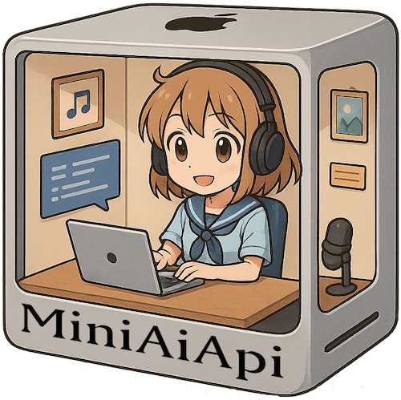

# MiniAiApi

**中文** | [English](README.en.md)

> 为 M 系 Mac 打造的 OpenAI 兼容 API



## 概述

MiniAiApi 是一个专为 M 系列芯片的 Mac （尤其是 Mac Mini ）优化的 AI 能力服务，它尝试利用 Mac 生态支持的软件和框架（ MLX ）来提供性能最高的、和 OpenAI 兼容的 API 接口。

## 功能特性

- 🎤 **Text-to-Speech (TTS)**: 使用 macOS 原生 `say` 命令进行语音合成
- 🎵 **Voice Cloning**: 基于 MLX-Audio 和 SparkTTS 的高质量音频克隆技术
- 🎧 **Speech-to-Text (STT)**: 基于 MLX Whisper 的语音识别
- 🤖 **Chat Completion**: 代理转发到 LMstudio 的聊天接口
- 🔗 **Embeddings**: 代理转发到 LMstudio 的嵌入模型接口
- 🎨 **Image Generation**: 集成 Draw Things Mac App 进行 AI 绘图
- 🔌 **OpenAI 兼容**: 完全兼容 OpenAI API 格式
- ⚡ **高性能**: 针对 M 系列 Mac 优化
- 🛡️ **安全**: 支持 API 密钥认证

## API 支持状态

| API 端点 | 状态 | 说明 | 依赖服务 |
|---------|------|------|---------|
| `/v1/audio/speech` | ✅ 可用 | TTS 语音合成 (传统 + 克隆) | macOS `say` / MLX-Audio |
| `/v1/audio/transcriptions` | ✅ 可用 | 语音转文字 | MLX Whisper |
| `/v1/audio/translations` | ✅ 可用 | 语音翻译为英文 | MLX Whisper |
| `/v1/chat/completions` | ✅ 可用 | 聊天对话 | LMstudio |
| `/v1/embeddings` | ✅ 可用 | 文本嵌入 | LMstudio |
| `/v1/images/generations` | ✅ 可用 | 图像生成 | Draw Things |
| `/v1/models` | ✅ 可用 | 获取模型列表 | - |
| `/health` | ✅ 可用 | 健康检查 | - |

> **备注**: 
> - ✅ 表示已实现并可用的 API
> - 部分 API 需要额外的依赖服务才能正常工作
> - 所有 API 都兼容 OpenAI 的请求和响应格式

## 系统要求

- macOS (推荐 macOS 14+)
- Node.js 18+
- MLX Whisper (用于语音识别)
- MLX-Audio (用于音频克隆，可选)
- FFmpeg (用于音频格式转换)
- LMstudio (用于聊天和嵌入功能)
- Draw Things Mac App (用于图像生成，可选)

## 安装

### 1. 克隆项目

```bash
git clone <repository-url>
cd miniAiApi
```

### 2. 安装依赖

```bash
npm install
```

### 3. 安装系统依赖

```bash
# 安装 MLX Whisper
pip install mlx-whisper

# 安装 MLX-Audio (可选，用于音频克隆)
pip install mlx-audio

# 安装 FFmpeg
brew install ffmpeg

# 安装和配置 LMstudio
# 1. 从官网下载并安装 LMstudio
# 2. 启动 LMstudio，在设置中开启 API Server
# 3. 设置监听地址为 127.0.0.1:1234（默认）

# 安装和配置 Draw Things (可选)
# 1. 从 App Store 安装 Draw Things
# 2. 在设置→高级设置中启用 HTTP API Server
# 3. 设置监听地址为 127.0.0.1:7860（默认）
```

### 4. 预下载模型 (可选)

建议预先下载模型以避免首次使用时的等待：

```bash
# 安装 Hugging Face CLI (如果还没有安装)
pip install huggingface_hub

# 下载 whisper
hf download mlx-community/whisper-large-v3-mlx (Large模型中文识别效果较好)

# 下载推荐的中文 TTS 模型
hf download mlx-community/Spark-TTS-0.5B-fp16
hf download mlx-community/Spark-TTS-0.5B-4-6bit(备用，克隆效果较差，但更快)

# 下载其他可用模型 (可选)
hf download mlx-community/Kokoro-82M-bf16 (中文非常不行，其他语言可以)
```

> **注意**: 下载模型可能需要几分钟到几十分钟，取决于网络速度。使用 `hf download` 命令可以看到下载进度。

### 5. 配置环境

```bash
cp env.example .env
```

编辑 `.env` 文件配置你的设置：

```env
# 服务器配置
PORT=3000
HOST=0.0.0.0

# TTS 配置
TTS_VOICE=Yue
TTS_OUTPUT_FORMAT=mp3

# TTS 音频克隆配置 (可选)
TTS_CLONE_ENABLED=false
TTS_CLONE_MODEL=mlx-community/Spark-TTS-0.5B-fp16
TTS_CLONE_REF_AUDIO=/path/to/reference/audio.mp3
TTS_CLONE_REF_TEXT=参考音频对应的文本内容
TTS_CLONE_LANG_CODE=z
TTS_CLONE_SPEED=1.0

# STT 配置
STT_MODEL=mlx-community/whisper-large-v3-mlx
STT_LANGUAGE=zh

# API 安全
API_KEY_REQUIRED=false
API_KEY=your-api-key-here

# LMstudio 配置
LMSTUDIO_BASE_URL=http://127.0.0.1:1234
LMSTUDIO_API_KEY=
LMSTUDIO_TIMEOUT=60000

# Draw Things 配置
DRAW_THINGS_BASE_URL=http://127.0.0.1:7860
DRAW_THINGS_ENABLED=false
DRAW_THINGS_TIMEOUT=120000
```

## 音频克隆配置示例

### 完整配置步骤

1. **启用音频克隆功能**
   ```env
   TTS_CLONE_ENABLED=true
   ```

2. **选择并下载模型**
   ```bash
   # 推荐：高质量中文模型
   hf download mlx-community/Spark-TTS-0.5B-fp16
   
   # 或者：量化版本 (占用内存更少)
   hf download mlx-community/Spark-TTS-0.5B-4-6bit
   ```

3. **配置模型和参考音频**
   ```env
   TTS_CLONE_MODEL=mlx-community/Spark-TTS-0.5B-fp16
   TTS_CLONE_REF_AUDIO=/Users/yourname/audio/reference.mp3
   TTS_CLONE_REF_TEXT=这是参考音频中说话人说的完整内容，需要与音频内容完全匹配。
   TTS_CLONE_LANG_CODE=z
   TTS_CLONE_SPEED=1.0
   ```

4. **准备参考音频**
   - 音频质量要高，背景噪音少
   - 时长建议 10-30 秒
   - 支持格式：MP3, WAV, M4A 等
   - 参考文本必须与音频内容完全匹配

### 测试配置

配置完成后，可以通过以下命令测试：

```bash
# 测试传统 TTS
curl -X POST http://localhost:3000/v1/audio/speech \
  -H "Content-Type: application/json" \
  -d '{"model": "tts-1", "input": "测试传统语音合成"}' \
  --output test_normal.mp3

# 测试音频克隆
curl -X POST http://localhost:3000/v1/audio/speech \
  -H "Content-Type: application/json" \
  -d '{"model": "tts-1:clone", "input": "测试音频克隆功能"}' \
  --output test_clone.mp3
```

## 使用方法

### 启动服务

```bash
# 生产环境
npm start

# 开发环境（自动重启）
npm run dev
```

服务启动后，访问 http://localhost:3000 查看 API 信息。

### API 接口

#### 1. 语音合成 (TTS)

##### 传统 TTS (使用 macOS 系统语音)

```bash
curl -X POST http://localhost:3000/v1/audio/speech \
  -H "Content-Type: application/json" \
  -d '{
    "model": "tts-1",
    "input": "你好，这是一个测试。",
    "voice": "alloy",
    "response_format": "mp3"
  }' \
  --output speech.mp3
```

**支持的语音**:
- `alloy` → Yue (中文)
- `echo` → Ting-Ting (中文)
- `fable` → Sin-ji (中文)
- `onyx` → Li-mu (中文)
- `nova` → Mei-Jia (中文)
- `shimmer` → Yu-shu (中文)

##### 音频克隆 TTS (使用 MLX-Audio)

要使用音频克隆功能，只需在模型名称后添加 `:clone` 后缀：

```bash
curl -X POST http://localhost:3000/v1/audio/speech \
  -H "Content-Type: application/json" \
  -d '{
    "model": "tts-1:clone",
    "input": "其实模型的幻觉不是什么大问题，不如说，相信概率模型预训练的知识，本身就是缘木求鱼。模型的核心还是推理能力要强，然后导入可信上下文，再通过推理能力去得出答案。",
    "voice": "alloy",
    "response_format": "mp3",
    "speed": 1.5
  }' \
  --output cloned_speech.mp3
```

> **注意**: 
> - 使用克隆模式前，需要在 `.env` 中配置 `TTS_CLONE_ENABLED=true` 和相关参数
> - 需要提供参考音频文件和对应的参考文本
> - 克隆模式会忽略 `voice` 参数，使用配置的参考音频进行音色克隆

#### 2. 语音识别 (STT)

```bash
curl -X POST http://localhost:3000/v1/audio/transcriptions \
  -H "Content-Type: multipart/form-data" \
  -F file="@audio.mp3" \
  -F model="whisper-1" \
  -F language="zh"
```

#### 3. 语音翻译

```bash
curl -X POST http://localhost:3000/v1/audio/translations \
  -H "Content-Type: multipart/form-data" \
  -F file="@audio.mp3" \
  -F model="whisper-1"
```

#### 4. 获取模型信息

```bash
curl http://localhost:3000/v1/models
```

#### 5. 聊天对话 (Chat Completion)

```bash
curl -X POST http://localhost:3000/v1/chat/completions \
  -H "Content-Type: application/json" \
  -H "Authorization: Bearer your-api-key" \
  -d '{
    "model": "gpt-3.5-turbo",
    "messages": [
      {"role": "user", "content": "你好"}
    ]
  }'
```

#### 6. 文本嵌入 (Embeddings)

```bash
curl -X POST http://localhost:3000/v1/embeddings \
  -H "Content-Type: application/json" \
  -H "Authorization: Bearer your-api-key" \
  -d '{
    "model": "text-embedding-ada-002",
    "input": "这是一段需要向量化的文本"
  }'
```

#### 7. 图像生成 (Image Generation)

```bash
curl -X POST http://localhost:3000/v1/images/generations \
  -H "Content-Type: application/json" \
  -H "Authorization: Bearer your-api-key" \
  -d '{
    "prompt": "一只可爱的小猫在花园里玩耍",
    "n": 1,
    "size": "1024x1024",
    "quality": "standard",
    "style": "vivid"
  }'
```

#### 8. 健康检查

```bash
curl http://localhost:3000/health
```

## 配置选项

### TTS 配置

- `TTS_VOICE`: 默认语音 (默认: Yue)
- `TTS_OUTPUT_FORMAT`: 输出格式 (mp3/wav)
- `TTS_TEMP_DIR`: 临时文件目录

### TTS 音频克隆配置

- `TTS_CLONE_ENABLED`: 是否启用音频克隆功能 (默认: false)
- `TTS_CLONE_MODEL`: MLX-Audio 模型名称 (默认: mlx-community/Spark-TTS-0.5B-fp16)
- `TTS_CLONE_REF_AUDIO`: 参考音频文件路径 (必须，用于克隆音色)
- `TTS_CLONE_REF_TEXT`: 参考音频对应的文本内容 (必须，用于模型对齐)
- `TTS_CLONE_LANG_CODE`: 语言代码 (默认: z，表示中文)
- `TTS_CLONE_SPEED`: 语音速度 (默认: 1.0，范围 0.5-2.0)

**推荐的 MLX-Audio 模型**:
- `mlx-community/Spark-TTS-0.5B-fp16` - 高质量中文 TTS 模型 (推荐)
- `mlx-community/Spark-TTS-0.5B-4-6bit` - 量化版本，占用内存更少
- `mlx-community/Kokoro-82M-bf16` - 多语言支持的轻量模型

**语言代码说明**:
- `z` - 中文 (推荐用于中文文本)
- `a` - 美式英语
- `b` - 英式英语
- `j` - 日语

### STT 配置

- `STT_MODEL`: Whisper 模型 (默认: mlx-community/whisper-large-v3-mlx)
- `STT_LANGUAGE`: 识别语言 (zh/en/auto 等)
- `STT_OUTPUT_DIR`: 输出目录

### LMstudio 配置

- `LMSTUDIO_BASE_URL`: LMstudio 服务地址 (默认: http://127.0.0.1:1234)
- `LMSTUDIO_API_KEY`: LMstudio API 密钥 (可选)
- `LMSTUDIO_TIMEOUT`: 请求超时时间 (默认: 60000ms)

### Draw Things 配置

- `DRAW_THINGS_BASE_URL`: Draw Things HTTP API 地址 (默认: http://127.0.0.1:7860)
- `DRAW_THINGS_ENABLED`: 是否启用图像生成功能 (默认: false)
- `DRAW_THINGS_TIMEOUT`: 请求超时时间 (默认: 120000ms)

### 可用的 Whisper 模型

- `mlx-community/whisper-tiny`
- `mlx-community/whisper-base`
- `mlx-community/whisper-small`
- `mlx-community/whisper-medium`
- `mlx-community/whisper-large-v2`
- `mlx-community/whisper-large-v3`
- `mlx-community/whisper-large-v3-mlx`
- `mlx-community/whisper-large-v3-turbo`

## 开发

### 项目结构

```
miniAiApi/
├── src/
│   ├── index.js              # 主服务器文件
│   ├── services/
│   │   ├── ttsService.js     # TTS 服务
│   │   └── sttService.js     # STT 服务
│   ├── routes/
│   │   ├── audioRoutes.js    # 音频 API 路由
│   │   └── imageRoutes.js    # 图像 API 路由
│   └── middleware/
│       └── auth.js           # 认证中间件
├── config/
│   └── default.js            # 配置管理
├── public/
├── env.example
├── package.json
└── README.md
```

### 添加新功能

1. 在 `src/services/` 中添加新的服务类
2. 在 `src/routes/` 中添加对应的路由
3. 在 `src/index.js` 中注册路由
4. 更新配置文件和文档

## 错误处理

API 使用标准的 HTTP 状态码和 OpenAI 兼容的错误格式：

```json
{
  "error": {
    "message": "错误描述",
    "type": "error_type",
    "code": "error_code"
  }
}
```

## 性能优化

- 临时文件自动清理（每小时）
- 支持并发请求处理
- 针对 Mac Mini M4 的 MLX 优化
- 音频格式自动转换

## 安全注意事项

- 生产环境建议启用 API 密钥认证
- 限制文件上传大小（默认 50MB）
- 定期清理临时文件
- 使用 HTTPS（需要配置 SSL 证书）

## 故障排除

### 常见问题

1. **TTS 不工作**
   - 检查 macOS 语音是否可用: `say -v ?`
   - 确保 FFmpeg 已安装

2. **音频克隆不工作**
   - 检查 MLX-Audio 是否安装: `python -m mlx_audio.tts.generate --help`
   - 确保配置了 `TTS_CLONE_ENABLED=true`
   - 检查参考音频文件是否存在且可读
   - 确保参考文本与参考音频内容匹配
   - 验证模型是否已下载: `ls ~/.cache/huggingface/hub/`
   - 检查语言代码是否正确 (中文使用 `z`)

3. **STT 不工作**
   - 检查 MLX Whisper 是否安装: `which mlx_whisper`
   - 确保模型已下载

4. **文件上传失败**
   - 检查文件大小是否超限
   - 确保音频格式受支持

5. **LMstudio 代理失败**
   - 检查 LMstudio 是否启动并开启 API Server
   - 确认地址和端口配置正确
   - 检查 API Key 是否匹配

6. **图像生成失败**
   - 确认 Draw Things 已安装并启用 HTTP API Server
   - 检查 `DRAW_THINGS_ENABLED=true` 配置
   - 确认 Draw Things 监听在正确的端口 (7860)

### 日志查看

服务会输出详细的日志信息，包括：
- 请求处理时间
- 错误堆栈跟踪
- 服务状态检查

## 许可证

MIT License

## 贡献

欢迎提交 Issues 和 Pull Requests！

## 更新日志

### v1.1.0
- ✨ 新增音频克隆功能，基于 MLX-Audio
- 🎵 支持使用参考音频进行音色克隆
- 🔧 添加灵活的克隆配置选项
- 📚 完善文档和故障排除指南

### v1.0.0
- 初始版本发布
- 支持 TTS、STT 和翻译功能
- OpenAI API 兼容
- Mac Mini M4 优化
